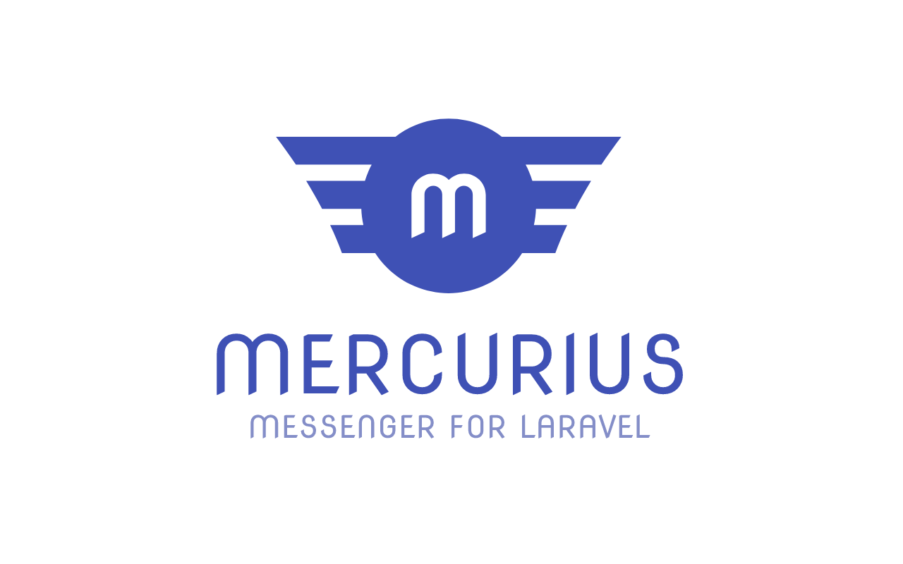
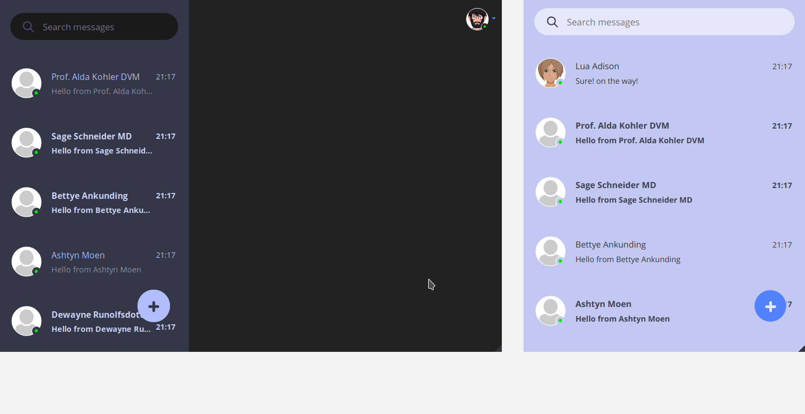
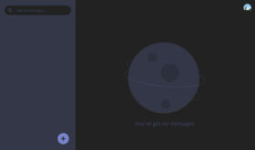
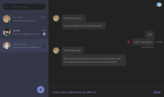
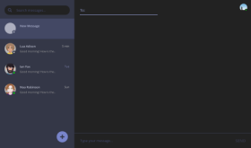
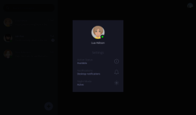

<p align="center">
    <a href="https://www.github.com/launcher-host/mercurius/" target="_blank">
        
    </a>
</p>

<p align="center">
<a href="https://travis-ci.org/launcher-host/mercurius"></a>
<a href="https://styleci.io/repos/147903408/shield?style=flat"></a>
<a href="https://packagist.org/packages/launcher/mercurius"></a>
<a href="https://packagist.org/packages/launcher/mercurius"></a>
<a href="https://packagist.org/packages/launcher/mercurius"></a>
</p>


## Table of Contents

* [About](#about)
* [Preview](#preview)
* [Features](#features)
* [Screenshots](#screenshots)
* [Demo](#demo)
* [Requirements](#requirements)
* [Installation](#installation)
* [Customization](#customization)
* [Roadmap](#roadmap)
* [Support](#support)
* [Contributing](#contributing)
* [Changelog](#changelog)
* [Credits](#credits)
* [Copyright & License](#copyright-and-license)


## About
Mercurius is a real-time messenger system using Laravel and Vue.js, featuring a complete application that you can easily install with any Laravel project.


## Preview
<a href="docs/mercurius_preview_2018-oct.gif" target="_blank">
    
</a>

<br>

## Features

- Real-time Messenger
- Responsive
- Multilingual
- Browser notifications
- Unique UX, with dark and light theme
- Lazy load messages
- Remove conversations and messages
- Search recipients with auto-complete

<br>

## Screenshots
<div>
    <a href="docs/mercurius_01_home.png" target="_target" title="screenshot mercurius - no conversations"></a>
    <a href="docs/mercurius_02_view_conversation.png" target="_target" title="screenshot mercurius - view conversation"></a>
    <a href="docs/mercurius_03_messages_hover.png" target="_target" title="screenshot mercurius - messages hover"></a>
</div>
<div>
    <a href="docs/mercurius_04_compose_message.png" target="_target" title="screenshot mercurius - compose message"></a>
    <a href="docs/mercurius_05_find_recipient_results.png" target="_target" title="screenshot mercurius - find recipient results"></a>
    <a href="docs/mercurius_06_user_settings.png" target="_target" title="screenshot mercurius - user settings"></a>
</div>
<small>Click thumbs to enlarge image</small>

<br>

## Demo

You can [try a demo](http://mercurius-demo.herokuapp.com/login) of Mercurius. Authenticate using any of the following credentials:

- `ian@launcher.host`
- `noa@launcher.host`
- `lua@launcher.host`

Password: `password`


Tip: Open 2 different browsers and login with different usernames, so you can test send/receiving messages.


<br>

## Requirements

- Laravel 5.6 or 5.7
- Pusher account
- Vue.js 2.0
- Bootstrap 4

<br>

## Installation

##### 1. Setup Pusher
If you don't have an account, create a free one on [pusher.com website](https://pusher.com/).
Go to the dashboard, create a new app and take note of the API credentials.

Now, let's add the API keys to the `.env` file.
Also, change the `BROADCAST_DRIVER` to `pusher` (default is `log`).
```php
...
BROADCAST_DRIVER=pusher
...
PUSHER_APP_ID="xxxxxx"
PUSHER_APP_KEY="xxxxxxxxxxxxxxxxxxxx"
PUSHER_APP_SECRET="xxxxxxxxxxxxxxxxxxxx"
PUSHER_APP_CLUSTER="xx"
```

##### 2. Register `BroadcastServiceProvider`
Open `config/app.php` and uncomment the line `App\Providers\BroadcastServiceProvider::class,`.


##### 3. Laravel Authentication
Skip this step if authentication is already setup, otherwise type:
```bash
php artisan make:auth
```


##### 4. Install Mercurius
```bash
composer require launcher/mercurius
```


##### 5. Configuration (optional)
If you want to change the default configuration, publish the config file, by typing the command:
```bash
php artisan vendor:publish --tag=mercurius-config
```

For editing the config, open `/config/mercurius.php` and add your own values.

```php
return [

    /*
    |--------------------------------------------------------------------------
    | Mercurius Models
    |--------------------------------------------------------------------------
    |
    | Defines the models used with Mercurius, use it to extend Mercurius and
    | create your own implementation.
    |
    */

    'models' => [
        'user' => App\User::class,
        'messages' => Launcher\Mercurius\Models\Message::class,
    ],
];
```


##### 6. Install Mercurius

```bash
php artisan mercurius:install
composer dump-autoload
```


##### 7. Install dummy data (for testing)
```bash
php artisan db:seed --class=MercuriusDatabaseSeeder
```
Will add Messages and Users to the system, like in the [demo example](#demo):

Demo Users:

- Ian: `ian@launcher.host`
- Noa: `noa@launcher.host`
- Lua: `lua@launcher.host`

Password: `password`


<br>


## Customization
Please see [Customization](docs/customization.md) for more information.


<br>


## Roadmap
Check the [roadmap](https://github.com/launcher-host/mercurius/issues/8) for more information.

- Unit Tests
- Typing indicator
- Broadcast user status (when he goes on/off)
- Conversation with multiple users
- Search in messages content
- Upload photos and attach files
- Preview images and videos
- Emoji support
- Video Chat
- Support socket.io
- Web Hooks


<br>

## Support
- Create a [new issue](../../issues)
- Join us on [Slack Channel](http://mercurius-demo.herokuapp.com/join-slack-launcher-host)

<br>

## Contributing
Please see [CONTRIBUTING](CONTRIBUTING.md) for more information.

<br>

## Changelog
We keep a [CHANGELOG](CHANGELOG.md) with the information that has changed.

<br>

## Credits
- [Bruno Torrinha](https://torrinha.com)
- [All Contributors](../../contributors)

<br>

## Copyright and license
Copyright 2018 [Bruno Torrinha](https://torrinha.com). Mercurius is released under the [MIT License](LICENSE).
